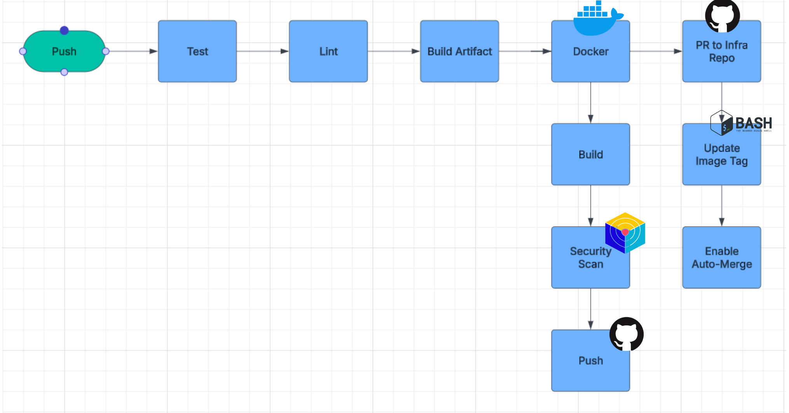
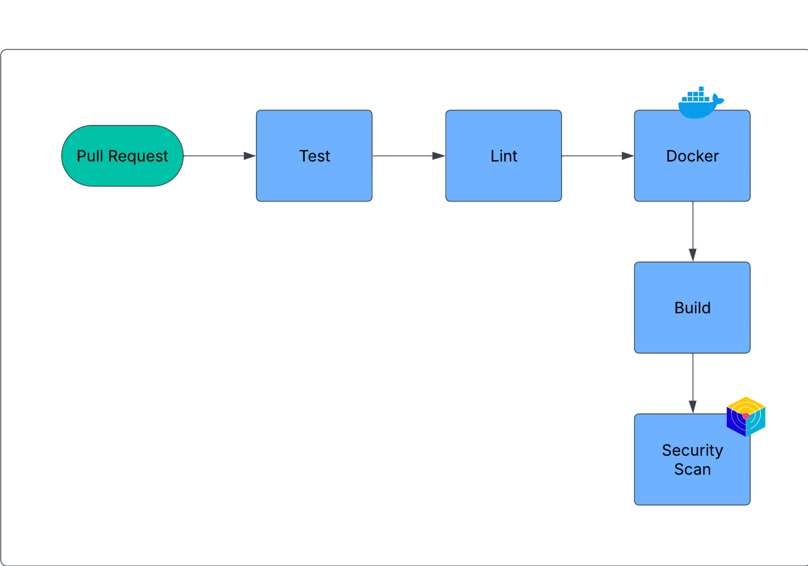

# SpringBoot + React Web App – DevOps Edition

**Frontend**  
[](https://github.com/HasanAshab/spring-react-devops-appservice/actions/workflows/frontend-ci.yaml)
[](https://github.com/HasanAshab/spring-react-devops-appservice/pkgs/container/spring-react-devops-appservice-frontend)

**Backend** 
[](https://github.com/HasanAshab/spring-react-devops-appservice/actions/workflows/backend-ci.yaml)
[](https://github.com/HasanAshab/spring-react-devops-appservice/pkgs/container/spring-react-devops-appservice-backend)


This is a DevOps-enhanced deployment of a [Spring Boot + React full stack app](https://github.com/purshink/ReactJS-Spring-Boot-Full-Stack-App), restructured and productionized with best practices for containerization, CI/CD, and cloud deployment.

---

## 🚀 DevOps Features Implemented

* **Dockerized Build**: Multi-stage Dockerfiles for lean image sizes.
* **Local Development**: Supports `docker-compose` with hot reload for local debugging.
* **Azure App Service Deployment**: Web app is containerized and deployed using Azure-native resources.
* **CI with GitHub Actions**: This project is equipped with a robust DevSecOps CI/CD pipeline.

---

## 🧑‍💻 Local Development

To spin up the application locally with Docker:

```bash
docker-compose up
```

Once running, the server will be accessible at:
**[http://localhost:4200](http://localhost:4200)**

Frontend supports hot reload out of the box.

## 🏗️ Infrastructure
Checkout the [IaC repository](https://github.com/HasanAshab/spring-react-devops-appservice-infra) for this project's infrastructure.

## ⚙️ CI/CD Pipeline

This project is equipped with a robust DevSecOps CI/CD pipeline via GitHub Actions:

* **Push Pipeline**
  

* **Pull Request Pipeline**
  

---

## 🐞 Known Issues

You can find ongoing bugs, limitations, or caveats in the [Known Issues](./KNOWN_ISSUES.md) document.

---


## 🙋‍♂️ About Me
**Hasan Ashab** – DevOps Engineer  
LinkedIn: [@hasan-ashab](https://www.linkedin.com/in/hasan-ashab-b9b20a290)
---