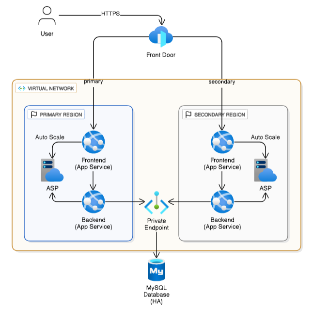
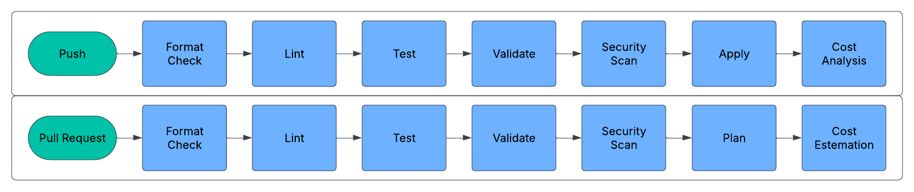

# Infrastructure As Code (IaC)

[](https://github.com/HasanAshab/three-tier-devops-azure/actions/workflows/terraform-cicd.yaml)
[](https://github.com/HasanAshab/three-tier-devops-azure/actions/workflows/terraform-drift.yaml)

This repository contains the infrastructure (IaC) for [the Spring React DevOps App Service](https://github.com/HasanAshab/spring-react-devops-appservice) project.


## 🏗️ Architecture Diagram




## ⚙️ CI/CD Pipeline


---


## 🚀 How to Apply

Follow these steps to deploy the infrastructure using Terraform:

### 1. Copy Environment Configuration

```bash
cp .env.sample .env
```

Edit `.env` and override necessary variables according to your environment (e.g., subscription ID, tenant ID, resource group names).

### 2. Load Environment Variables

```bash
source ./bin/load_env.sh
```

This script will export all environment variables defined in `.env` for the current shell session.

### 3. Select Terraform Workspace

Choose the workspace you want to deploy (e.g., `dev` or `prod`):

```bash
terraform workspace select dev
```

If the workspace doesn't exist yet, create it:

```bash
terraform workspace new dev
```

### 4. Apply Terraform Configuration

Run Terraform apply with the corresponding tfvars file:

```bash
terraform apply -var-file=./envs/dev.tfvars
```

For production:

```bash
terraform apply -var-file=./envs/prod.tfvars
```

---

## 🟦🟩 Deployment Strategy

~~The files `frontend.auto.tfvars` and `backend.auto.tfvars` contain the Docker image tags used for the frontend and backend services, respectively.~~

~~These tags are automatically updated by the CD pipeline of the [spring-react-devops-appservice](https://github.com/HasanAshab/spring-react-devops-appservice) repository after each successful build. This ensures the infrastructure always deploys the latest tested images without manual intervention.~~

### **🆕 New Strategy (Blue-Green Deploy)**

* The infrastructure code (Terraform) sets the default container image tag as `latest`.
* During the **application CI build**:

  * A Docker image is built and pushed with a unique tag (e.g., commit SHA).
  * The built image reference (`image_ref`) is passed to the **Blue-Green Deployment** workflow.
* The **Blue-Green Deployment pipeline**:

  * Deploys the specific `image_ref` to the **staging slot**.
  * After successful deployment, it **swaps the staging slot with production**.
* This approach ensures:

  * Fine-grained control over which image version gets deployed.
  * Infrastructure code remains **untouched and environment-agnostic**.
  * Supports **safe deployment practices** like Blue-Green without modifying `.tfvars` files or redeploying Terraform.

---
